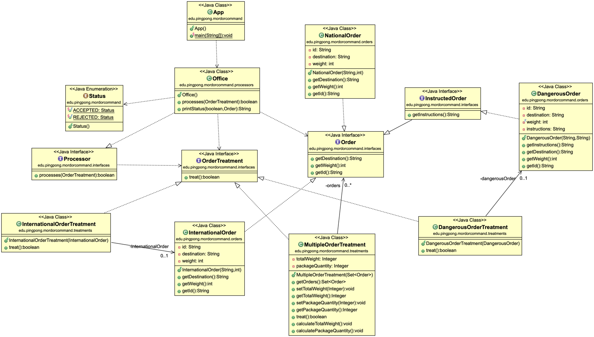

# MordorCommand
Exercise to put a design pattern into practice, in this case the "command" pattern has been used, a project carried out by putting TDD, DDD, SOLID ... into practice.

### The problem:

It is important to keep in mind that a design pattern is not a specific solution, a design pattern is a construction plan that can lead us to the most optimal solution.

In this case we must program an app that will simulate the logic of a post office that processes orders.

Each order has its own treatment (behavior), so there are orders of different types, each with its own particularities.

And depending on the treatment of the order, the order can be processed or not (true / false), the office(processor) is in charge of process and informing the status of the order.

### Why Command Pattern?
To solve this problem, the Command pattern comes in handy, it is a behavior type pattern that converts a request (treatment) into an independent object that contains all the information necessary to act on it.

With this pattern we make good use of the principle of separation of responsibilities SRP(Single Responsability Principle) adding an additional layer of abstraction that will handle the different behaviors of the orders.

This pattern comes in handy in this case because we are encapsulating the different behaviors (treatments)

With this pattern applied for this problem we also have the advantage of being able to extend its code easily, since to add more behaviors, we do not have to modify the current ones, we would have to add more Classes (Treatment). As far as we are making a code that fulfills the OCP principle (Open / Closed Principle).

### UML Diagram of the code:

